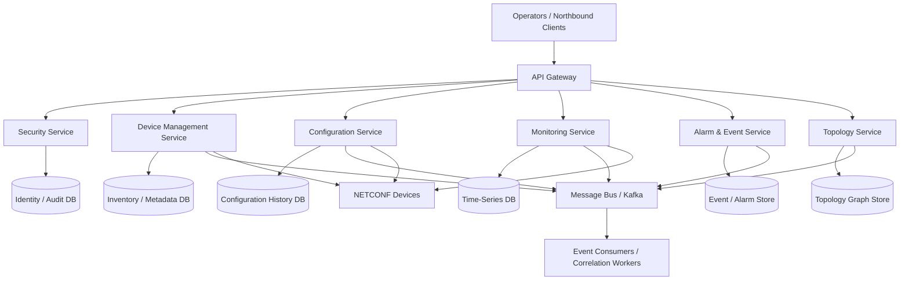
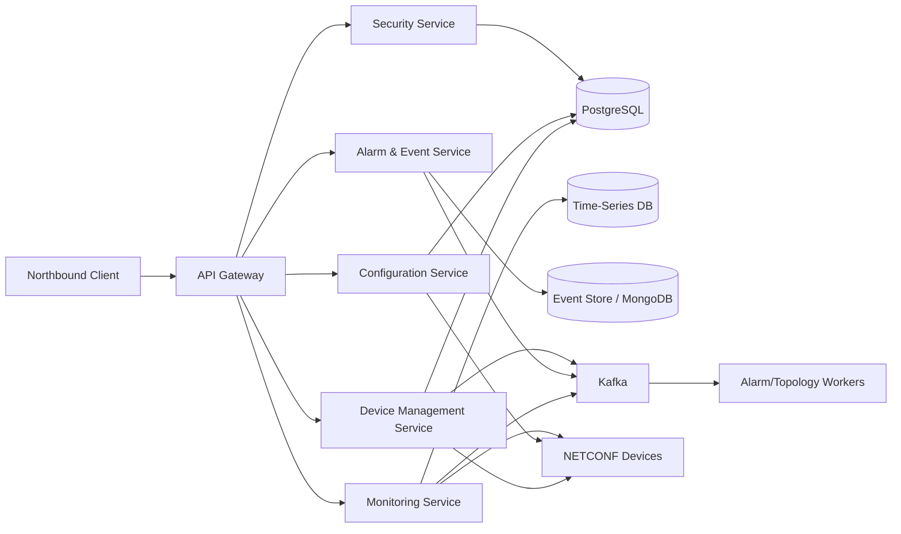

# Spring Boot Based NMS Microservices Architecture

## Overview
This document outlines a Spring Boot-based Network Management System (NMS) microservices architecture for managing network devices and services.

## Core Goals
- Build modular microservices for network operations.
- Support southbound device communication using NETCONF.
- Implement FCAPS-based network management capabilities.
- Enable scalable, independently deployable services.

## Architecture Scope

### 1. Southbound Layer
- Use NETCONF as the primary southbound protocol for device configuration and state retrieval.
- Support device discovery, configuration management, and operational data collection.
- Provide protocol adapters for NETCONF sessions and RPC handling.

### 2. FCAPS Coverage
The system will support FCAPS functions:
- Fault Management
- Configuration Management
- Accounting Management
- Performance Management
- Security Management

## Suggested Microservices

### 1. Device Management Service
- Discovers and inventories network devices.
- Maintains device metadata and connectivity state.

### 2. Configuration Service
- Handles device configuration operations.
- Uses NETCONF edit-config and get-config operations.

### 3. Monitoring Service
- Collects telemetry and alarms from devices.
- Supports performance and fault monitoring.

### 4. Alarm & Event Service
- Processes events and notifications.
- Supports thresholding, correlation, and alert handling.

### 5. Security Service
- Manages authentication, authorization, and secure device access.

### 6. API Gateway / Integration Layer
- Exposes unified APIs to northbound clients.
- Routes requests to relevant services.

## API Gateway, Service Discovery, and Load-Balanced URLs

### API Gateway
- Use Spring Cloud Gateway as the northbound entry point for all client traffic.
- The gateway should expose a single public URL such as `https://api.nms.example.com`.
- It can route requests to services like Device Management, Configuration, Monitoring, Alarm, and Security.
- The gateway is a good place to enforce authentication, rate limiting, request logging, and API versioning.

### Service Discovery with Eureka
- Register each Spring Boot microservice with Eureka Server.
- Services should discover each other using logical names instead of hard-coded IPs and ports.
- Example service IDs could be:
  - `DEVICE-MANAGEMENT-SERVICE`
  - `CONFIGURATION-SERVICE`
  - `MONITORING-SERVICE`
  - `ALARM-SERVICE`
  - `SECURITY-SERVICE`
- This makes scaling and deployment easier because new instances can be added without changing client configuration.

### Load-Balanced Service URLs
- In a Spring Cloud setup, clients can use load-balanced URLs such as `lb://DEVICE-MANAGEMENT-SERVICE`.
- In Kubernetes, internal service URLs are commonly used, for example:
  - `http://device-management-service:8080`
  - `http://configuration-service:8080`
  - `http://alarm-service:8080`
- The gateway can forward requests to these internal service URLs, while the load balancer distributes traffic across healthy instances.
- A typical request flow becomes:
  1. Client calls the gateway URL.
  2. Gateway routes to the appropriate service by service name.
  3. Eureka/LoadBalancer resolves the target instance.
  4. The request is served through the chosen backend instance.

## Technology Stack
- Java 17+ / Spring Boot
- Spring Cloud (optional for service discovery, config, gateway)
- NETCONF client library / custom NETCONF adapter
- PostgreSQL or MongoDB for persistence
- Kafka or RabbitMQ for event-driven integration
- Docker and Kubernetes for deployment

## Database and Caching Strategy

### Databases
- Use PostgreSQL for transactional and relational data such as device inventory, users, policies, and configuration history.
- Use MongoDB for flexible, document-oriented data such as alarms, events, and telemetry payloads.
- Use a time-series database such as InfluxDB or TimescaleDB for large-scale performance metrics and historical counters.
- Keep device configuration versions and audit trails in a durable relational store.

### Caching
- Use Redis for caching frequently accessed device inventory information, topology summaries, and recent alarms.
- Cache static or slowly changing data such as device capabilities and topology graph snapshots.
- Use short-lived cache entries for hot APIs such as real-time health status and recent alarms.
- Avoid caching highly dynamic or security-sensitive data without strict expiration and invalidation rules.

### Data Flow Design
- Write-through or write-behind patterns can be used for telemetry ingestion depending on scale.
- Event data can be published to Kafka and then persisted to the relevant database.
- The cache should be invalidated when device state, topology, or configuration changes.

## Example Service Flow
1. Client sends a request to the API Gateway.
2. The gateway routes the request to the appropriate service.
3. The service uses NETCONF to communicate with network devices.
4. Device responses are normalized and persisted.
5. Events and alarms are published for downstream processing.

## Initial Design Notes
- Keep the southbound layer isolated from business logic.
- Use asynchronous event handling for alarms and notifications.
- Design services around domain concerns rather than monolithic NMS functions.

## Functional Flow Details

### 1. Device Discovery Flow
1. The Device Management Service starts a discovery job.
2. It probes configured IP ranges or device inventories.
3. For each reachable device, it opens a NETCONF session.
4. It retrieves capabilities, hostname, serial number, software version, and interface list.
5. The discovered device is normalized into a domain model and stored in the inventory database.
6. The topology service is notified so the new device can be linked into the network map.

### 2. Topology Discovery Flow
1. The topology service reads inventory data from the Device Management Service.
2. It collects link information from LLDP, CDP, or device inventory data.
3. It builds relationships such as device-to-device, device-to-interface, and interface-to-link.
4. The topology graph is stored in a graph database or relational model.
5. Any change in connectivity triggers an update event for northbound clients and alarm processing.

### 3. Performance Data Collection Flow
1. The Monitoring Service schedules periodic polling jobs.
2. It sends NETCONF RPCs or other southbound requests to devices.
3. It collects metrics such as CPU usage, memory, interface throughput, packet loss, and latency.
4. Metrics are normalized and stored in time-series storage.
5. Threshold evaluation is performed to identify degradation or anomalies.
6. If thresholds are crossed, an event is raised for alarm correlation.

### 4. Alarm Correlation Flow
1. Devices send alarms, notifications, or traps through the southbound integration layer.
2. The Alarm & Event Service receives raw alarms in near real time.
3. Events are enriched with device context, topology context, and severity metadata.
4. Correlation rules are applied to determine if alarms are:
   - duplicates of existing alarms,
   - symptoms of a broader network issue,
   - or related to a parent/child topology event.
5. A correlated alarm is created or an existing alarm is updated.
6. The correlated alarm is published to subscribers and exposed through the northbound API.

### 5. Example End-to-End Scenario
- A router reports high CPU usage.
- The Monitoring Service stores the performance metric.
- The threshold engine detects a performance anomaly.
- The Alarm & Event Service correlates this with a device-down event from the same node.
- The system raises a single correlated alarm such as: "Node X experiencing degradation and connectivity loss".
- The topology service highlights the affected device and its neighboring devices.

## Service Communication and Security

### Synchronous Communication
- Use REST or gRPC for request-response interactions such as device lookup, configuration change requests, and northbound API calls.
- Synchronous communication is suitable when the caller needs an immediate response.
- Keep synchronous calls short and bounded to avoid cascading failures across services.

### Asynchronous Communication
- Use Kafka or RabbitMQ for events such as alarms, topology updates, and performance metric ingestion.
- Asynchronous communication is ideal for scale-out, eventual consistency, and decoupling producers from consumers.
- Event-driven patterns help the platform handle bursts of telemetry and alarms efficiently.

### Security Considerations
- Secure all service-to-service communication with TLS and mutual authentication where possible.
- Protect NETCONF sessions with SSH and strong device credentials.
- Use OAuth2/OpenID Connect or service-to-service tokens for northbound and internal API security.
- Apply RBAC and least-privilege access for operators and services.
- Store secrets in a secure secret manager such as Kubernetes Secrets, Vault, or cloud secret stores.
- Log and audit configuration changes, alarm acknowledgements, and privileged operations.

## High-Level Architecture Diagram



## Detailed Deployment Topology

```mermaid
flowchart LR
    subgraph Ingress
      Ingress[Ingress / Load Balancer]
      Ingress --> Gateway[API Gateway]
    end

    subgraph ControlPlane
      Gateway --> Eureka[Eureka Service Registry]
      Gateway --> ConfigServer[Config Server]
      Gateway --> Auth[Security Service]
    end

    subgraph Services
      Gateway --> Device[Device Management Service]
      Gateway --> Config[Configuration Service]
      Gateway --> Mon[Monitoring Service]
      Gateway --> Alarm[Alarm & Event Service]
      Gateway --> Topo[Topology Service]
    end

    subgraph Observability
      Tracing[OpenTelemetry / Jaeger]
      Metrics[Prometheus]
      Logging[ELK / Loki]
      Metrics --> Dashboard[Grafana]
      Logging --> Dashboard
      Tracing --> Dashboard
    end

    subgraph DataStores
      DB1[(PostgreSQL)]
      DB2[(TimescaleDB / InfluxDB)]
      DB3[(MongoDB)]
      Broker[(Kafka)]
      SecretStore[(Vault / Secrets)]
    end

    Device --> DB1
    Config --> DB1
    Mon --> DB2
    Alarm --> DB3
    Auth --> DB1
    Device --> Broker
    Config --> Broker
    Mon --> Broker
    Alarm --> Broker
    Gateway --> Metrics
    Gateway --> Tracing
    Gateway --> Logging
    Device --> Metrics
    Device --> Tracing
    Device --> Logging
    Config --> Metrics
    Config --> Tracing
    Config --> Logging
    Mon --> Metrics
    Mon --> Tracing
    Mon --> Logging
    Alarm --> Metrics
    Alarm --> Tracing
    Alarm --> Logging
    Topo --> Metrics
    Topo --> Tracing
    Topo --> Logging
    Gateway --> SecretStore
    Auth --> SecretStore
    Device --> SecretStore
    Config --> SecretStore
```

## Production-Grade Architecture Considerations

### 1. Architecture Principles
- Prefer domain-driven service boundaries rather than technical layering alone.
- Keep device-facing logic isolated from business orchestration.
- Design for failure by assuming that networks, devices, and downstream services may become unavailable.
- Make the platform observable and auditable from day one.
- Ensure that every service can scale independently and be deployed independently.

### 2. Observability and Monitoring
- Each service should expose health endpoints such as `/actuator/health` and `/actuator/prometheus`.
- Use OpenTelemetry for distributed tracing across gateway, services, and message brokers.
- Collect metrics for request latency, error rates, device connection health, NETCONF session counts, and queue depth.
- Centralize logs in an ELK or Loki-based stack and correlate them with alarms and topology events.
- Build dashboards for service health, device inventory status, topology changes, and alarm trends.

### 3. Resilience and Fault Tolerance
- Apply retries with exponential backoff for transient failures in NETCONF and remote service calls.
- Use circuit breakers and rate limiting to avoid cascading failures during device storms or partial outages.
- Add request timeouts to prevent services from hanging on slow or unresponsive devices.
- Use bulkheads to isolate critical functions such as telemetry ingestion from configuration operations.
- Implement dead-letter queues and compensating workflows for message processing failures.
- Design for idempotency so repeated events or retries do not create duplicate configuration changes or duplicate alarms.

### 4. Deployment and Runtime Platform
- Deploy services as stateless containers in Kubernetes or a similar container orchestration platform.
- Use ingress controllers or an API gateway for external access and TLS termination.
- Configure readiness and liveness probes for each service.
- Use horizontal pod autoscaling for services that experience bursty traffic or telemetry spikes.
- Support rolling deployments and blue/green or canary rollout strategies.
- Ensure each service has resource limits, quotas, and autoscaling policies suited to its workload.

### 5. Configuration Management and Secrets
- Externalize configuration using Spring Cloud Config, Kubernetes ConfigMaps, or environment variables.
- Keep secrets in Vault, Azure Key Vault, AWS Secrets Manager, or Kubernetes Secrets.
- Separate environment-specific settings for development, testing, staging, and production.
- Version configuration changes and track who changed what and when.
- Avoid embedding device credentials or private keys in application code.

### 6. Data Strategy and Retention
- Use PostgreSQL for transactional records such as inventory, users, policies, and configuration history.
- Use TimescaleDB or InfluxDB for time-series data such as CPU, memory, interface counters, and performance trends.
- Use MongoDB or document storage for flexible event payloads, partial device metadata, and near-real-time alarm records.
- Define retention policies for telemetry, configuration snapshots, alarm history, and audit logs.
- Ensure backup, restore, and disaster-recovery procedures are part of the platform design.

### 7. Eventing and Integration Patterns
- Publish domain events when devices are discovered, topology changes, alarms are created, and configurations are applied.
- Use an outbox pattern to guarantee that domain changes and broker events are persisted consistently.
- Version event schemas to avoid breaking downstream consumers.
- Preserve event ordering where needed for alarm correlation and topology updates.
- Use consumer groups for parallel processing of telemetry and alarms.

### 8. Security and Governance
- Enforce RBAC for operator access and service-to-service access.
- Use OAuth2/OIDC for user authentication and token-based access for internal services.
- Apply least-privilege principles to device credentials and automation jobs.
- Maintain audit trails for configuration changes, alarm acknowledgements, role changes, and privileged actions.
- Support tenant-aware or multi-domain isolation if the platform will serve multiple customers or network regions.

### 9. CI/CD and Operational Readiness
- Build each service independently with automated tests, static analysis, and container image generation.
- Use CI pipelines to run unit, integration, and contract tests before deployment.
- Package deployment manifests for Kubernetes and support environment promotion through staging and production.
- Define rollback strategies and incident playbooks for service outages, device communication failures, and data inconsistencies.

### 10. Example Reference Deployment Topology


## Detailed Service Boundaries

### 1. API Gateway
- Owns the external northbound entry point and public API surface.
- Handles authentication, routing, rate limiting, request tracing, and API versioning.
- Should not contain business logic for device operations; it should delegate to domain services.
- Depends on Security Service for identity and on each domain service for request routing.

### 2. Security Service
- Owns identity, authentication, authorization, credential vault access, and audit policy enforcement.
- Manages service-to-service tokens, operator roles, device credential references, and permission scopes.
- Should expose APIs for operator login, token issuance, role assignment, and secret lookup.
- It is a shared dependency for the API Gateway and for device/configuration operations.

### 3. Device Management Service
- Owns the canonical inventory of network devices.
- Responsible for discovery, registration, lifecycle state, reachability, capability discovery, and device metadata management.
- Maintains the source of truth for device identity, vendor, model, location, and connectivity state.
- Publishes domain events when devices are discovered, removed, or become unreachable.

### 4. Configuration Service
- Owns configuration intent and configuration version history.
- Responsible for preparing, validating, applying, and rolling back network device configs.
- Stores configuration snapshots, planned changes, and deployment history.
- Uses NETCONF to push or retrieve configuration changes and publishes events after successful apply operations.

### 5. Monitoring Service
- Owns telemetry collection, scheduling, polling jobs, and performance metrics processing.
- Collects counters such as CPU, memory, interface throughput, packet loss, and latency.
- Performs threshold evaluation and forwards anomalies or trend data to the Alarm & Event Service.
- Uses time-series data stores for efficiency and history.

### 6. Alarm & Event Service
- Owns alarm creation, deduplication, correlation, severity enrichment, and incident state changes.
- Processes raw events from devices and internal services and produces correlated alarms for operators.
- Maintains alarm lifecycle states such as open, acknowledged, suppressed, cleared, and resolved.
- Publishes alarm and event streams to UI clients and downstream automation services.

### 7. Topology Service
- Owns network topology relationships between devices, interfaces, links, and zones.
- Builds and maintains graph-style topology data using inventory and discovery data.
- Supports topology change events and impact analysis for alarms and incidents.
- Can be implemented as a separate service for larger deployments or embedded in Device Management for smaller ones.

## FCAPS Mapping to Concrete Service Responsibilities

| FCAPS Area | Primary Service(s) | Concrete Responsibilities |
|---|---|---|
| Fault Management | Alarm & Event Service, Monitoring Service, Device Management Service | Detect device failures, detect threshold breaches, correlate alarms, raise incidents, track state changes. |
| Configuration Management | Configuration Service, Device Management Service | Manage config templates, validate configs, apply changes, store version history, support rollback. |
| Accounting Management | Security Service, API Gateway | Track operator actions, authenticate access, enforce role-based usage, store audit trails for admin and API usage. |
| Performance Management | Monitoring Service, Topology Service | Collect telemetry, analyze trends, monitor SLA metrics, detect degradation, correlate performance issues with topology context. |
| Security Management | Security Service, API Gateway, Device Management Service | Protect device access credentials, enforce RBAC, secure NETCONF sessions, log privileged actions, support secret rotation. |

## Example API Contracts

### API Gateway
- GET /api/v1/devices
- GET /api/v1/devices/{deviceId}
- POST /api/v1/devices/discover
- POST /api/v1/configurations/{deviceId}/apply
- GET /api/v1/alarms
- POST /api/v1/alarms/{alarmId}/acknowledge

### Device Management Service
- POST /devices
  - Creates a device record.
- GET /devices/{deviceId}
  - Returns inventory details.
- PATCH /devices/{deviceId}/state
  - Updates reachability or lifecycle state.
- POST /devices/discovery/jobs
  - Starts a discovery job.

### Configuration Service
- GET /configurations/{deviceId}
  - Returns the current effective configuration.
- POST /configurations/{deviceId}/validate
  - Validates a candidate configuration.
- POST /configurations/{deviceId}/apply
  - Applies a configuration change.
- GET /configurations/{deviceId}/history
  - Returns previous versions.

### Monitoring Service
- POST /telemetry/{deviceId}
  - Ingests telemetry samples.
- GET /devices/{deviceId}/metrics
  - Returns recent performance values.
- GET /devices/{deviceId}/health
  - Returns current health status.

### Alarm & Event Service
- GET /alarms
  - Lists open and historical alarms.
- GET /alarms/{alarmId}
  - Retrieves a specific alarm.
- POST /alarms/{alarmId}/acknowledge
  - Acknowledges an alarm.
- POST /alarms/correlation/run
  - Triggers correlation for a set of events.

### Security Service
- POST /auth/token
  - Issues a service or operator token.
- POST /auth/validate
  - Validates an access token.
- POST /roles
  - Creates or updates a role.
- POST /credentials/{deviceId}
  - Stores or rotates device credentials.

## Example Event Schemas

### DeviceDiscoveredEvent
```json
{
  "eventId": "evt-1001",
  "eventType": "DeviceDiscovered",
  "deviceId": "dev-001",
  "hostname": "core-router-01",
  "ipAddress": "10.0.0.5",
  "capabilities": ["netconf", "ssh"],
  "occurredAt": "2026-07-04T10:00:00Z"
}
```

### ConfigurationAppliedEvent
```json
{
  "eventId": "evt-1002",
  "eventType": "ConfigurationApplied",
  "deviceId": "dev-001",
  "configurationVersion": "cfg-v42",
  "appliedBy": "operator-123",
  "status": "SUCCESS",
  "occurredAt": "2026-07-04T10:05:00Z"
}
```

### AlarmRaisedEvent
```json
{
  "eventId": "evt-1003",
  "eventType": "AlarmRaised",
  "alarmId": "alm-9001",
  "deviceId": "dev-001",
  "severity": "MAJOR",
  "title": "High CPU Usage",
  "description": "CPU usage exceeded threshold for 10 minutes",
  "occurredAt": "2026-07-04T10:10:00Z"
}
```

### TopologyChangedEvent
```json
{
  "eventId": "evt-1004",
  "eventType": "TopologyChanged",
  "sourceDeviceId": "dev-001",
  "targetDeviceId": "dev-002",
  "linkType": "ETHERNET",
  "status": "ACTIVE",
  "occurredAt": "2026-07-04T10:12:00Z"
}
```

## Example Deployment Manifests

### API Gateway Deployment
```yaml
apiVersion: apps/v1
kind: Deployment
metadata:
  name: api-gateway
spec:
  replicas: 2
  selector:
    matchLabels:
      app: api-gateway
  template:
    metadata:
      labels:
        app: api-gateway
    spec:
      containers:
        - name: api-gateway
          image: nms/api-gateway:latest
          ports:
            - containerPort: 8080
          env:
            - name: SPRING_PROFILES_ACTIVE
              value: prod
---
apiVersion: v1
kind: Service
metadata:
  name: api-gateway
spec:
  selector:
    app: api-gateway
  ports:
    - port: 80
      targetPort: 8080
```

### Device Management Service Deployment
```yaml
apiVersion: apps/v1
kind: Deployment
metadata:
  name: device-management-service
spec:
  replicas: 2
  selector:
    matchLabels:
      app: device-management-service
  template:
    metadata:
      labels:
        app: device-management-service
    spec:
      containers:
        - name: device-management-service
          image: nms/device-management-service:latest
          ports:
            - containerPort: 8081
          env:
            - name: SPRING_PROFILES_ACTIVE
              value: prod
---
apiVersion: v1
kind: Service
metadata:
  name: device-management-service
spec:
  selector:
    app: device-management-service
  ports:
    - port: 8081
      targetPort: 8081
```

## API Contract and Event Governance

### OpenAPI Specifications
- Each microservice should define its public API contract using OpenAPI 3.x.
- Store the specification in the service repository and expose it through a Swagger UI or Redoc endpoint.
- Use versioned API paths such as `/api/v1/...` and avoid breaking changes without a new version.
- Generate client SDKs or contract tests from the OpenAPI definitions to keep consumers aligned.
- Include request/response schemas, error models, authentication requirements, and pagination rules in the contract.

### Event Schema Versioning and Broker Topics
- Define event contracts in a shared schema registry or versioned repository.
- Use explicit event versions such as `v1`, `v2` to support backward compatibility.
- Publish events to clearly named topics such as:
  - `device.discovered`
  - `configuration.applied`
  - `alarm.raised`
  - `topology.changed`
- Include event metadata such as `eventId`, `eventVersion`, `occurredAt`, `sourceService`, and `correlationId`.
- Use consumer groups and schema compatibility rules so producers and consumers can evolve independently.
- Keep event payloads small, immutable, and domain-oriented rather than embedding large internal objects.

## Next Steps
- Choose the NETCONF library and transport approach.
- Create initial Spring Boot skeleton services for the boundaries above.
- Finalize observability, messaging, and persistence choices for production rollout.
